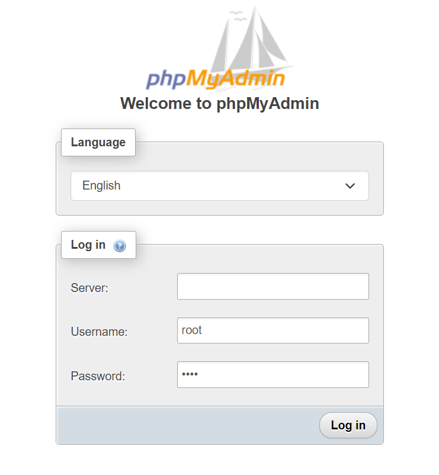
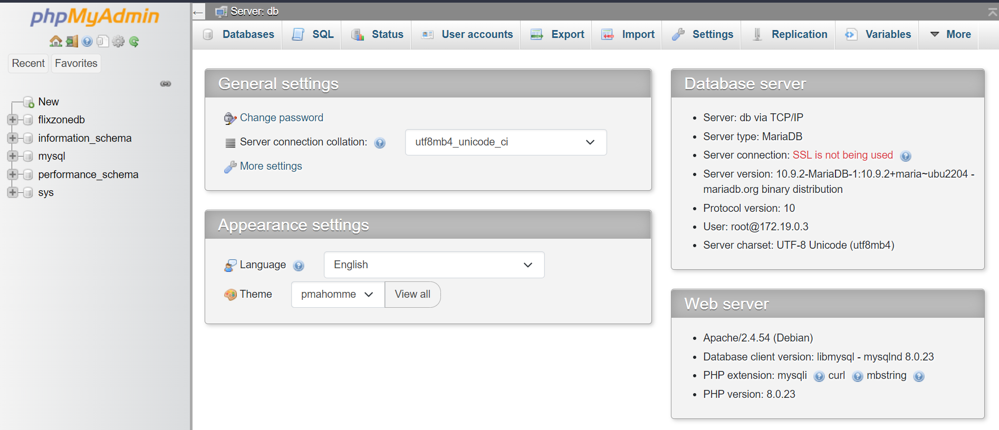

# MariaDB + PhpMyAdmin

## This repo contains the PhpMyadmin with MariaDB which is taken from the [Docker Hub](https://hub.docker.com/_/phpmyadmin)

- Go to the docker-compose.yml file and change the password for the user.
- You can also configure other options with the start.sh file
```shell
MYSQL_ROOT_PASSWORD: root # Chanage the password here
``` 
- You can leave the server empty since it's on same network
- The default username is **root**

## Screenshots

